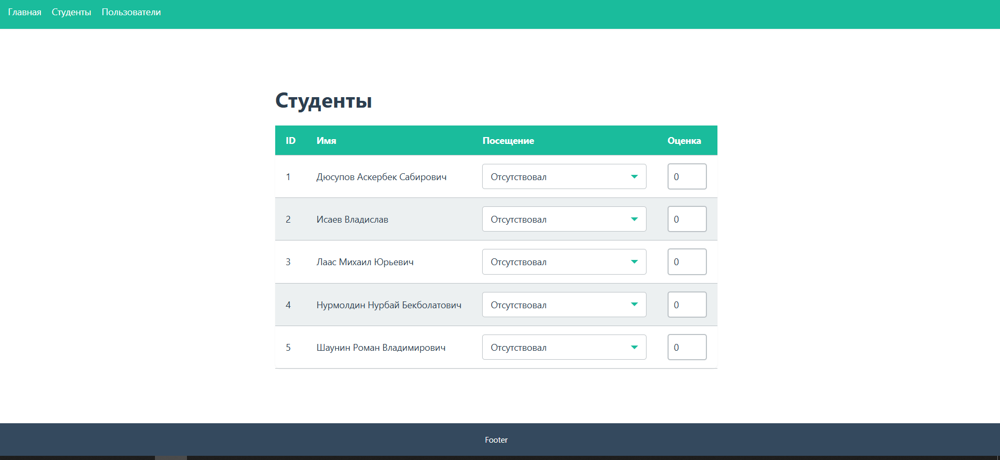
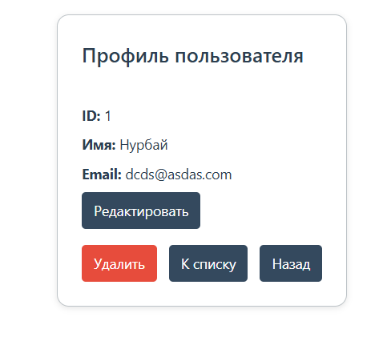

# Home work 6-9

Создать новый проект с использованием type script (хотя бы минимальным) проект должен уметь отрисовывать посты из API (для начала без полной реализации CRUD)

Добавил CRUD, кастомный hook, работу с API 

Учебный модуль для управления списком студентов: отображение, редактирование оценок и посещаемости.  
Стек: **React + React Router DOM + Redux Toolkit + TypeScript + SCSS modules**.

